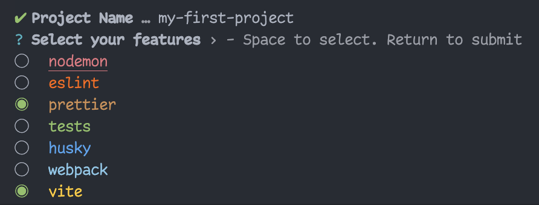

# create-pro-ts-lib

[](https://www.npmjs.com/package/create-pro-ts-lib)
[](https://github.com/MatanelGordon/create-pro-ts-lib/master/LICENSE)

`create-pro-ts-lib` is a tool to quickly start a Typescript library from a rigid customizable template.

- built-in templates for:
  <br/>[📂Nodemon](https://nodemon.io/)
  <br/>[🧪Tests [Jest]](https://jestjs.io/)
  <br/>[✨Prettier](https://prettier.io/)
  <br/>[👮🏻‍Eslint](https://eslint.org/)

these templates can be combined to allow maximum flexibility for your library.



And the folder structure would look like:

```bash
my-first-project
|-- src
|   -- index.ts
|-- .gitignore
|-- .npmrc
|-- .prettierrc
|-- LICENSE
|-- nodemon.json
|-- package.json
|-- tsconfig.json
```

## Usage

With NPM⚡:

```bash
$ npm create pro-ts-lib
```

With Yarn⚡:

```bash
$ yarn create pro-ts-lib
```

With PNPM⚡:

```bash
$ pnpm create pro-ts-lib
```

## Bonus Shorthand

```bash
$ npx cptl
```

Then follow the prompts!

# It's Not Only for Libraries

<p style="font-size: 16px; font-weight: bold">
    You can use it for <span style="color:#11CCEE">projects</span> as well, but remember:
</p>

- change `tsconfig.json` accordingly:
  - `lib` - add if needed
  - `module`
  - `target`
  - `declarations: false`
  - etc...


- change `package.json` accordingly
  - `licence`
  - `files` - remove entirely
  - `private: true` 
  - etc...


- have fun programming `:)`

## CLI Examples

Due to pro-ts-lib <b>incredible flexibility</b>, there are many aspects of the boilerplate which you can change via
flags in the CLI.

This next example creates a new Typescript project with <b>nodemon</b> `-n` and <b>prettier</b> `-p` called `my-project`
.

```bash
$ npm create pro-ts-lib my-project -n -p
```

To create a new Typescript project with tests `-t` , and it puts the test in a seperated folder `__tests__` due
to `--test-mode seperated`

```bash
$ npm create pro-ts-lib my-project -t --test-mode seperated
```

Note: When adding both prettier and eslint, it triggers a special logic which make them work together.

To create a new Typescript project with prettier `-p` and eslint `-e` and the content inside `src/` directory is in the
root folder.

```bash
$ npm create pro-ts-lib my-project -p -e --src-dir .
```

To install everything, use `--all` flag

```bash
$ npm create pro-ts-lib my-project --all
```

# Options

Each feature has its own flag:

- Tests `--tests` / `-t`
- Nodemon `--nodemon` / `-n`
- Prrettier `--prettier` / `-p`
- etc...⚡

# Advanced Options ⚠️

There are other flags that help you customize your boilerplate:

- `--name` - determine a different name than your directory name
- `--all` - ADD ALL FEATURES. 🔥
- `--src-dir` - determine where `src/` files should be. 📂

- `--test-mode` - determine test mode. 🧪
    - seperated - in a separate `__tests__` folder.
    - combined - in `src/` folder next to `index.ts` .

There are also options to handle the CLI:

- `--dry`🏜 - run the CLI with no consequences.
- `--no-color`🎨 - run CLI output without color.

## Note

Since they are quite unique and advanced, The following features __ARE NOT__ supported by the terminal UI prompt and
should be used as flags only:

- `--dry`🏜
- `--no-color`🎨
- `--src-dir`📂

But don't worry, you can use them alongside the UI prompts, for example:

```bash
$ npm create pro-ts-lib --no-color --src-dir lib
```

will result:


