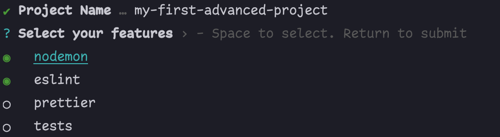

# create-pro-ts-lib

[](https://www.npmjs.com/package/create-pro-ts-lib)
[](https://github.com/MatanelGordon/create-pro-ts-lib/master/LICENSE)

`create-pro-ts-lib` is a CLI tool to quickly start a Typescript library from a rigid customizable template.

- built-in templates for:
    <br/>[🕵🏻‍♀️ Nodemon](https://nodemon.io/)
    <br/>[🧪 Tests [Vitest]](https://vitest.dev/)
    <br/>[✨ Prettier](https://prettier.io/)
    <br/>[👮🏻‍ Eslint](https://eslint.org/)
    <br/>[🐶 Husky](https://github.com/typicode/husky)
    <br/>[🧊 Webpack5](https://webpack.js.org/)
    <br/>[⚡ Vite](https://vitejs.dev/)

these templates can be combined to allow maximum flexibility for your library.


And the folder structure would look like:

```bash
my-first-project
|-- src
|   -- index.ts
|-- .gitignore
|-- .npmrc
|-- .prettierrc
|-- LICENSE
|-- nodemon.json
|-- package.json
|-- tsconfig.json
```

## Usage

With NPM⚡:

```bash
npm create pro-ts-lib@latest
```

With Yarn⚡:

```bash
yarn create pro-ts-lib@latest
```

With PNPM⚡:

```bash
pnpm create pro-ts-lib@latest
```

Then follow the prompts!

## Bonus Shorthand

This would do the same:

```bash
npx cptl
```

## It's Not Only for Libraries

<p style="font-size: 16px; font-weight: bold">
    You can use it for <span style="color:#11CCEE">projects</span> as well, but remember:
</p>

- change `tsconfig.json` accordingly:

  - `lib` - add if needed
  - `module`
  - `target`
  - `declarations: false`
  - etc...

- change `package.json` accordingly

  - `licence`
  - `files` - remove
  - `private: true`
  - `module` - remove
  - etc...

- have fun programming `:)`

### CLI Examples

Due to pro-ts-lib **incredible flexibility**, there are many aspects of the boilerplate which you can change via
flags in the CLI.

This next example creates a new Typescript project with **nodemon** `-n` and **prettier** `-p` called `my-project`
.

```bash
npm create pro-ts-lib my-project -n -p
```

To create a new Typescript project with tests `-t` , and it puts the test in a seperated folder `__tests__` due
to `--test-mode seperated`

```bash
npm create pro-ts-lib my-project -t --test-mode seperated
```

Note: When adding both prettier and eslint, it triggers a special logic which make them work together.

To install everything, use `--all` flag

```bash
npm create pro-ts-lib my-project --all
```

## Options

Each feature has its own flag:

- Tests `--tests` / `-t`
- Nodemon `--nodemon` / `-n`
- Prettier `--prettier` / `-p`
- Eslint `--eslint` / `-e`
- Vite `--vite` / `--vi`
- Webpack5 `--webpack` / `-w`


## Advanced Options ⚠️

### Other Flags
There are other flags that help you customize your boilerplate:

- `--name` - determine a different name than your directory name
- `--all` - ADD ALL FEATURES. 🔥

- `--test-mode` - determine test mode. 🧪
  - seperated - in a separate `__tests__` folder.
  - combined - in `src/` folder next to `index.ts` .

There are also options to handle the CLI:

- `--dry`🏜 - run the CLI with no consequences.
- `--no-color`🎨 - run CLI output without color.

### Vite / Webpack partial build

In vite/webpack projects, you can specify whether you want your build to output commonjs, esm, or both (default is both).

To output only commonjs files, use `COMMON_ONLY` variable before executing the build.

example when using vite:

package.json:
```json
{
    "scripts": "COMMON_ONLY=true vite build" 
}
```

However, if you want to output only esm files, use `ESM_ONLY` variable before executing the build:

example when using webpack:

package.json:
```json
{
    "scripts": "ESM_ONLY=true webpack"
}
```

> NOTE: Both `COMMON_ONLY` and `ESM_ONLY` will work for both `vite` and `webpack`.

> NOTE: You cannot use both variables at the same time. This will throw an error saying youre an idiot because you didnt read it <b style="font-size: 1.1rem">bundles to both commonjs and esm by default.</b> 

## Note

Since they are quite unique and advanced, The following features **ARE NOT** supported by the terminal UI prompt and
should be used as flags only:

- `--dry`🏜
- `--no-color`🎨

But don't worry, you can use them alongside the UI prompts, for example:

```bash
npm create pro-ts-lib --no-color -p -e
```

will result:


